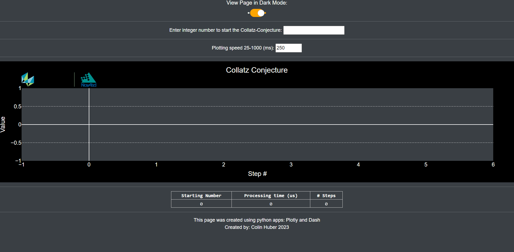

# Coding Club Collatz Conjecture Visualization with Plotly & Dash

The first challenge as part of the [Coding Club](https://teams.microsoft.com/l/team/19%3aQjxVFz5CwSOZ0nKM9tUXDfMh5xLaqD_Jn5hwdVgqEEs1%40thread.tacv2/conversations?groupId=1a34467b-4e60-461c-a845-202847e59a20&tenantId=1b16ab3e-b8f6-4fe3-9f3e-2db7fe549f6a) is to create a program in any language to do the following:

Take any positive integer ```n```.  If ```n``` is even, divide ```n``` by ```2```.  If ```n``` is odd then multiply by ```3``` and add one ```(3n + 1)```.  Repeat indefinitely until you reach the number ```1```.  Print out the numbers of the sequence and the number of steps required.

Example:  

```
Enter a number: 10 
10 
5 
16 
8 
4 
2 
1 
Steps: 7 
```
  
This is a famous mathematical problem also called 3n+1.  If you would like to learn more about this problem, watch this video: https://youtu.be/094y1Z2wpJg.

## Installation

Using [Python 3.11](https://www.python.org/downloads/release/python-3110/), the environment for this visualization can be set up as follows:

1. Clone the project into a new folder on your PC:
```
git clone https://gitlab.corp.novatel.ca/CHuber/collatz-conjecture.git
```

2. Create a new virtual environment as follows:
```
python -m venv code_env
```

3. Activate the virtual environment as follows in a command window:
```
cd code_env
cd scripts
activate
```

Once ```activate``` has been run, you should see ```(code_env)``` prepended to your directory in the command window.

4. Install required packages as follows:
```
pip install -r requirements.txt
```
Note: This may take several minutes to complete.

## Usage

Once installed with the virtual environment activated, start up the dash server by running the following in a command window:
```
python dash_cc.py
```

Open a browser window to http://127.0.0.1:8050/.  Enter in a number to start the plotting of the Collatz Conjecture.  The animiation speed can be selected to speed up or slow down the plotting.  The table at the bottom records the data for the browser session.



## Terminating Dash Server

In the console window, press ```CTRL+C``` or ```CTRL+Break``` to terminate the local Dash server.

## Known Issues

- The second iteration (step #2) from the collatz conjecture is not plotting.  This needs to be investigated in the clientside callback. 🤷‍♂️

## Contact

Contact Colin Huber for any questions or problems with the program! 😎